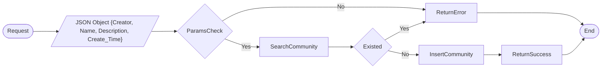
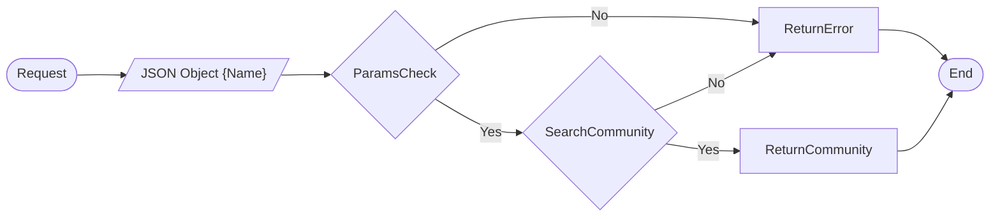
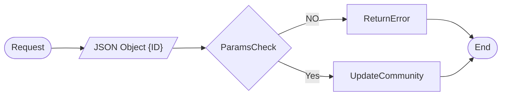
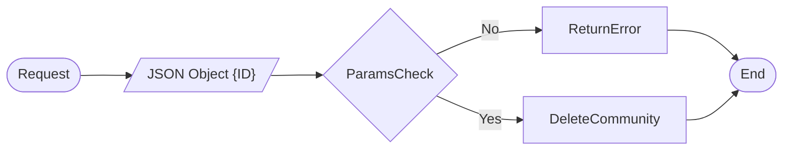

## Create Community

```mermaid
graph LR
Start([Request]) --> CommunityInfo[/"JSON Object {Creator, Name, Description, Create_Time}"/] --> ParamsCheck{ParamsCheck}
ParamsCheck --> |No| ReturnError[ReturnError] --> End([End])
ParamsCheck --> |Yes| SearchCommunity[SearchCommunity] --> Existed{Existed}
Existed --> |Yes| ReturnError
Existed --> |No| InsertCommunity[InsertCommunity] --> ReturnSuccess[ReturnSuccess] --> End
```

- If there are any server internal errors, it will return 500 to frontend immediately.

## Get Community Information

```mermaid
graph LR
Start([Request]) --> CommunityInfo[/"JSON Object {Name}"/] --> ParamsCheck{ParamsCheck}
ParamsCheck --> |No| ReturnError[ReturnError] --> End([End])
ParamsCheck --> |Yes| SearchCommunity{SearchCommunity}
SearchCommunity --> |No| ReturnError[ReturnError]
SearchCommunity --> |Yes| ReturnCommunity --> End
```

## Update Community Information

```mermaid
graph LR
Start([Request]) --> CommunityInfo[/"JSON Object {ID}"/] --> ParamsCheck{ParamsCheck}
ParamsCheck --> |NO| ReturnError[ReturnError] --> End([End])
ParamsCheck --> |Yes| UpdateCommunity[UpdateCommunity] --> End
```

## Delete Community

```mermaid
graph LR
Start([Request]) --> CommunityInfo[/"JSON Object {ID}"/] --> ParamsCheck{ParamsCheck}
ParamsCheck --> |No| ReturnError[ReturnError] --> End([End])
ParamsCheck --> |Yes| DeleteCommunity[DeleteCommunity] --> End
```
