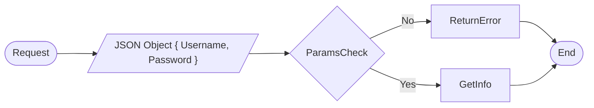
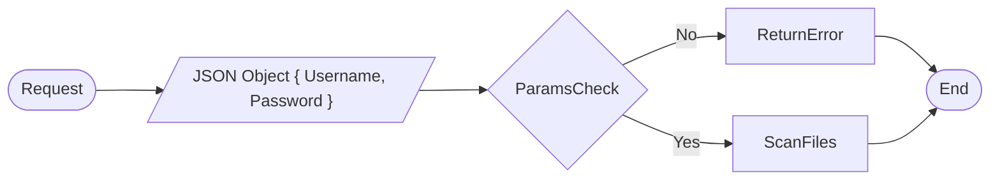
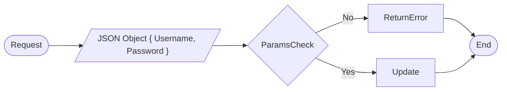
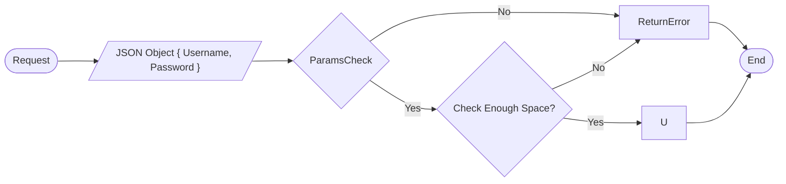
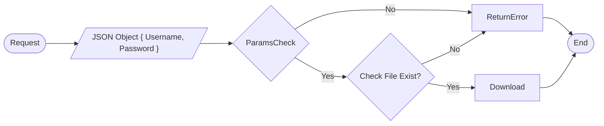

### User Files Scan

```mermaid
flowchart LR
	Start([Request]) --> UserInfo[/"JSON Object { Username, Password }"/] --> ParamsCheck{ParamsCheck}
	ParamsCheck --> |No| ReturnError[ReturnError] --> End([End])
	ParamsCheck --> |Yes| ScanFiles --> End
```

### User Space Info

```mermaid
flowchart LR
	Start([Request]) --> UserInfo[/"JSON Object { Username, Password }"/] --> ParamsCheck{ParamsCheck}
	ParamsCheck --> |No| ReturnError[ReturnError] --> End([End])
	ParamsCheck --> |Yes| GetInfo --> End


```

### User Files Delete

```mermaid
flowchart LR
	Start([Request]) --> UserInfo[/"JSON Object { Username, Password }"/] --> ParamsCheck{ParamsCheck}
	ParamsCheck --> |No| ReturnError[ReturnError] --> End([End])
	ParamsCheck --> |Yes| ScanFiles --> End
```

### Update User Capacity

```mermaid
flowchart LR
	Start([Request]) --> UserInfo[/"JSON Object { Username, Password }"/] --> ParamsCheck{ParamsCheck}
	ParamsCheck --> |No| ReturnError[ReturnError] --> End([End])
	ParamsCheck --> |Yes| Update --> End
```

### File Upload

```mermaid
flowchart LR
	Start([Request]) --> UserInfo[/"JSON Object { Username, Password }"/] --> ParamsCheck{ParamsCheck}
	ParamsCheck --> |No| Error[ReturnError] --> End([End])
	ParamsCheck --> |Yes| SpaceCheck{Check Enough Space?} --> |No| Error
	SpaceCheck --> |Yes| U --> End
```

### File Download

```mermaid
flowchart LR
	Start([Request]) --> UserInfo[/"JSON Object { Username, Password }"/] --> ParamsCheck{ParamsCheck}
	ParamsCheck --> |No| Error[ReturnError] --> End([End])
	ParamsCheck --> |Yes| FileCheck{Check File Exist?} --> |No| Error
	FileCheck --> |Yes| Download --> End
```