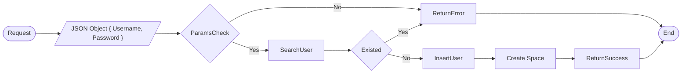
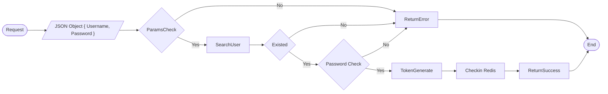
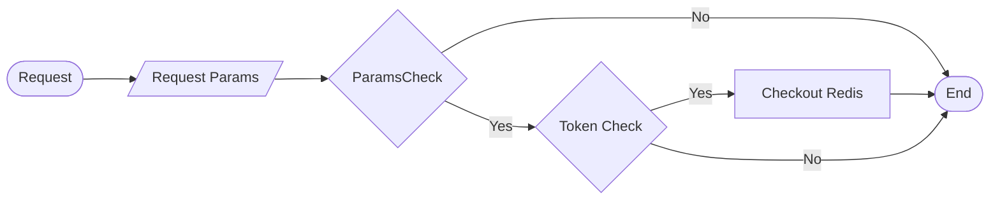
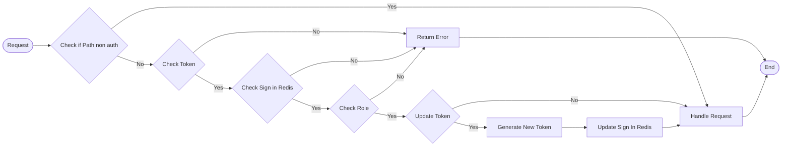
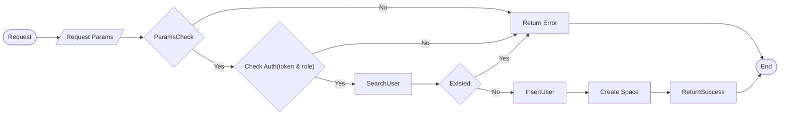
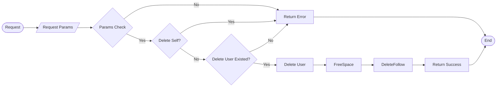
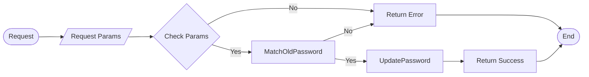
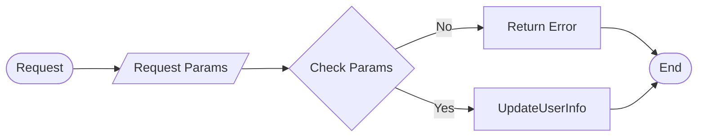
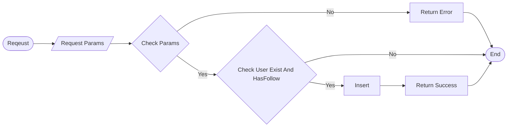

### Regular User Register



- If there are any server internal errors, it will return 500 to frontend immediately.


### User Login



### User Logout



### Auth




### Admin Register



### User Delete




### Update User Password




### Update User



### User Follow



### User Unfollow

```mermaid
flowchart LR
	Start([Reqeust]) --> ReqParams[/Request Params/] --> ParamsCheck{Check Params} --> |No| Error[Return Error] --> End([End])
	ParamsCheck --> Delete[] --> Success[Return Success] --> End
```


